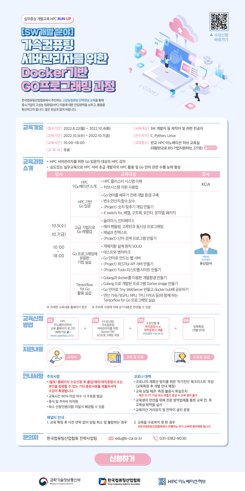

# 가속컴퓨팅 서버관리자를 위한 Docker기반 Go 프로그래밍 과정
  

# 교제 
- tucker의 go언어 프로그래밍
  

# 폴더구조
- c c언어 실습
- go go언어 실습
- lesson 강의내용
  - [첫날](./lesson/day1.md)
  - [둘째날](./lesson/day2.md)
  - [셋째날](./lesson/day3.md)

# 강사정보
한컴아카데미 유신 강사님
Sun microsystem 에서 회사생활을 첫 시작하셧으며 임베디드 분야를 주요 가르치심

# 후기
Go언어를 빠르게 한번 훓어보는 강의 였음.  
강사님이 임베디드 주요 분야로 가르쳐서 그런지 os 나 메모리 관련해서 조금더 깊게 볼 수 있었음.  
재귀호출시 무한루프에 빠지는 경우 코어덤프 뜰려고 한다던지 (결국 못떳지만) / top , htop 이런걸 알수있어서 나름 좋음.  
강의 내용은 평이한 수준의 강의였으며 3일내에 책한권을 보려고하여서 매우 빠르게 진행됨.  
  
강의장은 매우 좋음 (사진은 추후에 첨부). 커피와 간식이 제공됨

