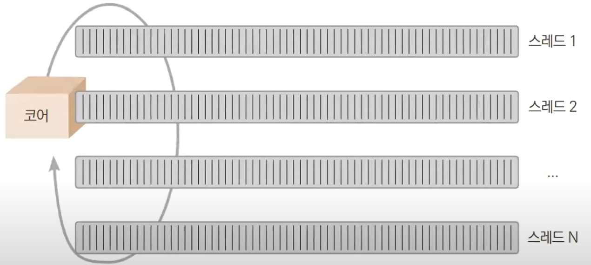
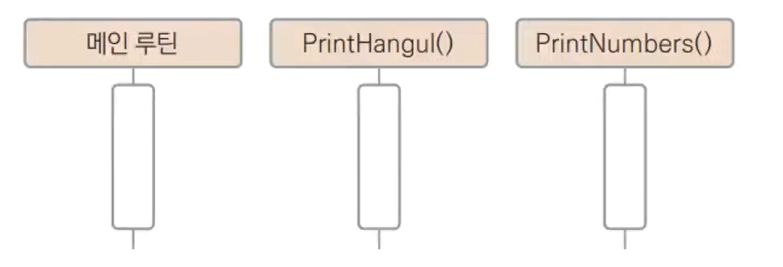
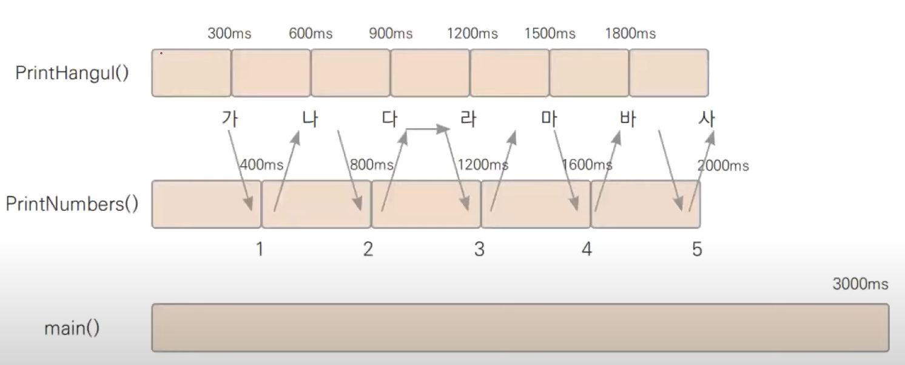

# [24장 고루틴](https://www.youtube.com/watch?v=tRdODUXV3ik)

## Go루틴 전에 쓰레드부터 알아보자
쓰레드(Thread)는 실행 흐름을 말한다.

초기에는 하나의 실행 흐름만 존재

## 멀티 쓰레드

코어가 빠르게 쓰레드를 교체한다.
이것이 어떻게 가능한가?

## 멀티쓰레딩 원리
CPU는 단순한 계산기이다. 쓰레드고 뭐고 알 바가 없다.  
모든것은 OS가 벌이는 매직

## 컨텍스트 스위칭(Context Switching)
쓰레드 전환에는 비용이 발생한다.   
이것을 컨텍스트 스위칭이라고 한다.  
  
만약 쓰레드갯수 = 코어갯수가 되면 어떻게 될까? (컨텍스트스위칭이 발생하지 않는다.)

## 고루틴(Go Routine)
메인함수도 고루틴-메인 고루틴이라고 부른다.
새로운 고루틴은 단순히 go 함수_호출로 만든다.
```go
go 함수_호출
```
## [ex24.1](ex24.1.go)
## 총세개의 고루틴 생성

## 출력순서



## 서브 고루틴이 종료될때까지 대기

```go 
var wg syncWaitGroup
wg.Add(3)   //작업 개수 설정
wg.Done()   //작업이 완료될 때마다 호출
wg.Wait()   //모든 작업이 완료될 때까지 대기
```
[ex24.2.go](ex24.2.go)


## 고루틴 동작원리
고루틴은 OS 쓰레드를 이용하는 경량쓰레드 (light weight thread) 이다.
## 결론은
아무리 많은 고루틴을 생성해도 컨텍스트 스위칭비용이 발생하지 않는다.
## 동시성프로그래밍의 주의점
동일한 메모리 자원을 여러 고루틴에서 접근할때 동시성 문제가 발생한다.
## 어떻게 해결해야 하는가?
메모리 자원을 하나의 고루틴에서만 접근하게 해야한다.
How?
가장 심플한(?) 접근법은 Lock을 사용하는 것이다.
이것을 `뮤텍스(Mutual Exclusion)`이라고 한다.
## 뮤텍스를 이용해서 문제 해결
[ex24.4](ex24.4.go)
## 뮤텍스의 문제점1
1. 동시성 프로그래밍으로 인한 성능 향상을 얻을 수 없다.  심지어 과도한 락킹으로 성능이 하락되기도 한다
2. 고루틴을 완전히 멈추게 만드는 데드락 문제발생  
[ex24.5.go](ex24.5.go)
## 또 다른 자원관리 기법
1. 영역을 나누는 방법 [ex24.6](ex24.6.go)
2. 역할을 나누는 방법
   1. 다음시간에 배울 channel 을 통해 알아보자

## Q&A
- 만약 교체를 대기하고 있는 고루틴이 여러개 일때, 어떤 고루틴을 선택해서 교체하나요?  우선순위가 있는 고루틴이 있는지 궁금합니다. 
  - gorun큐에 의해 관리되므로 순차적으로 실행한다고 볼수잇음
- 고루틴도 결국은 컨텍스트 스위칭이 일어난다고 하는데, 단지 운영체제 쓰레드 대비 리소스보단 고루틴이란 코드 흐름 기준으로만 하기 때문에 더 싸게 먹힌다고 불 수 있는 건가요?
  - OS 쓰레드가 컨텍스트시 스택메모리가 문제다. Go 컨텍스트 내에서는 heap 내에 있기 때문에 싸게먹힌다. 